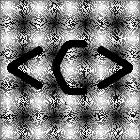

# mazesolving
A variety of algorithms to solve mazes from an input image.

## About
These are the python files associated with the computerphile video on maze solving. Feel free to use, alter, redistribute the code as you see fit.

I'm not actively developing this project, simply for time reasons. Mostly I want the code to be as it was (at least in general function) at the time of the video. If you're interested in improving the code, then you can fork it into your own repository and make any changes you wish. If you come up with something good, feel free to share it on the [wiki](https://github.com/mikepound/mazesolving/wiki), thanks to Jacob Mitchell for starting that.

## Input
Some example mazes are included in the repository. These were generated either by hand, or using the software [Daedalus](http://www.astrolog.org/labyrnth/daedalus.htm). Once exported I edited the mazes to ensure that the following rules are adhered to:

- Each maze is black and white. White represents paths, black represents walls.
- All mazes are surrounded entirely by black walls.
- One white square exists on the top row of the image, and is the start of the maze.
- One white square exists on the bottom row of the image, and is the end of the maze.

## Notes
This was just a side project I did for fun over a couple of evenings, I'm sure there are many improvements and extensions you could make if you wanted to. Some things to note:

- The data structures and representations can probably be improved for speed - I only focused a little on efficiency. Mostly I wanted to keep memory usage down, to allow the use of very large mazes.
- The very large mazes use a lot of ram. If you don't have 16Gb at least for the 10k+ x 10k+ mazes, you may run out of memory!
- The current format of the test mazes (short paths, very dense) means that in fact dijkstra and a* usually operate more slowly than simple algorithms. In these cases Dijkstra usually performs the same function as breadth first search, but with more computational overhead. There will be some forms of maze where they are significantly faster.
- Mazes don't need to be square - as long as they are surrounded by black walls. The input image will obviously be square.
- Large areas of white, using my algorithm, will essentially degenerate into an inefficient flood fill - avoid!

